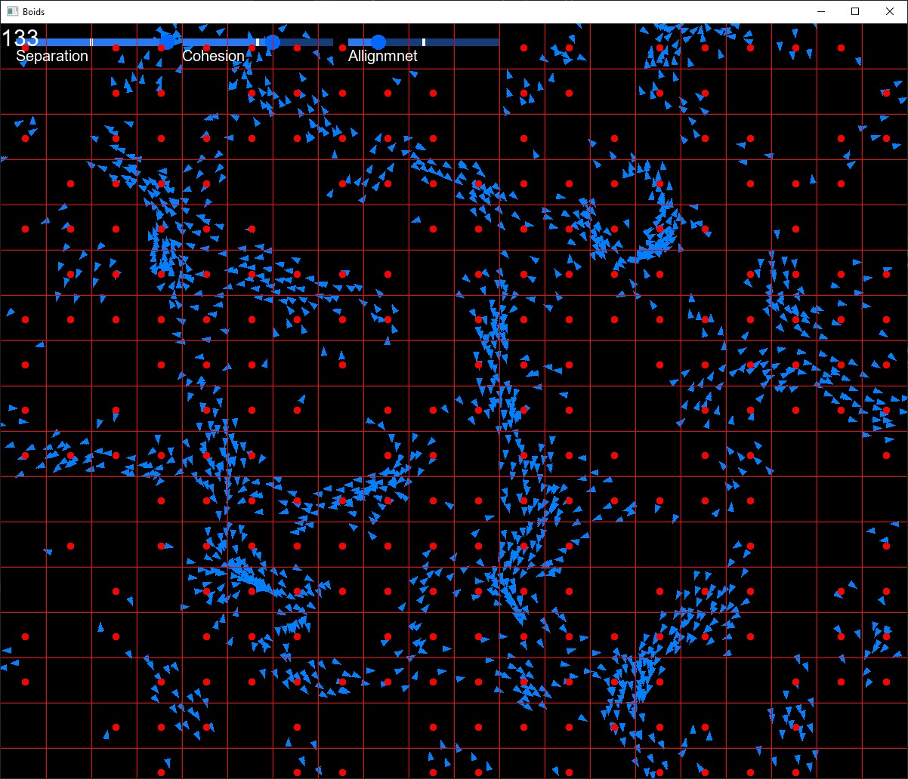
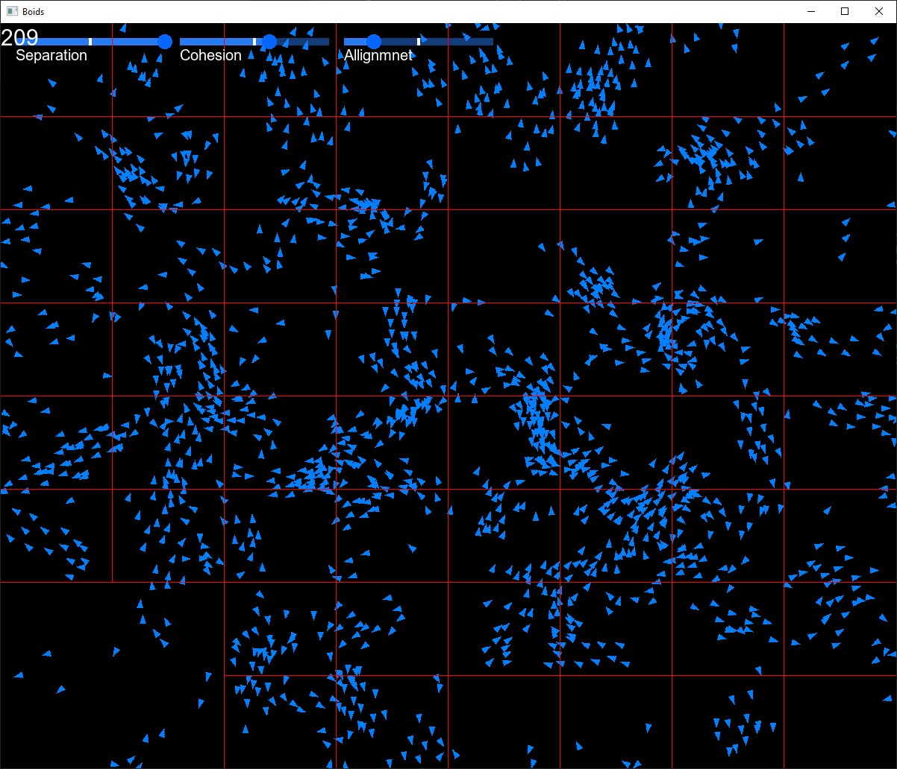

# Boids

Boids is a C++ application created using SFML for running a [Boids](https://en.wikipedia.org/wiki/Boids) simulation.

## Screenshots




## TODO

- Update UI to allow for greater user flexibility, including setting and disabling debug mode

## Requirements

- C++17
- CMake 3.28+

## How to Use

> **Note for Linux Users**:
> According to the [cmake-sfml-project](https://github.com/SFML/cmake-sfml-project#command-line) README you will need to install the following packages:
> - libxrandr-dev
> - libxcursor-dev
> - libxi-dev
> - libudev-dev
> - libfreetype-dev
> - libflac-dev
> - libvorbis-dev
> - libgl1-mesa-dev
> - libegl1-mesa-dev
> - libfreetype-dev
> - libharfbuzz-dev
> - libmbedtls-dev
> - libssh2-1-dev

1. Clone the repository
1. In the project root directory, run: 
    ```
    cmake -B build -DCMAKE_BUILD_TYPE="Release"
    cmake --build build --config Release
    ```
1. Run the executable found in ```build/bin/Release```

## License

[MIT](https://choosealicense.com/licenses/mit/)
